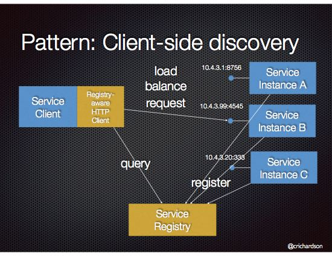

## Microservices:
Loosely coupled service oriented architecture with bounded context.

## Advantage
- desire of fastest change. 
- Need for greater availability
- Motivation for fine-grained scaling
- Devops Mindset

## Every application should be microservice?
It should not be in the case of rapidly evolve the business model and accompanying application they should start with monolithis like startup company .
If application itself has smaller scope it should not be 

## Decompose the application into service:
- Decomposition by business capability
- Decomposition by domain driven design subdomain.
- Decompose by use case or verb , like shipping service.
- Decompose by noun or resources by defining a service that is responsible for all operation on entity/ resource. Like Account service, user maintainence

## Core characteristic of microservice:
- Component exposed as service
- Tied to specific domain
- Loosely coupled
- Build to tolerate failure
- Deliver continously delivery via automation
- Built and run by individual team.

## Data Consistency
Each microservice will have their own DB. We must use SAGA pattern.

## How to implement queries that need to retrieve data owned by multiple service
API Composition or CQRS pattern.

## Spring cloud
- Build common distributed system pattern.
- Open source software
- Include NetflixOss Technologies.

#Service Discovery:
1. Client side service discovery
2. Server side service discovery

### Client-side discovery:
1. Each service will itself register with service registry.
2. Client will have have Registry aware HTTP client which will query the url with service registry.
3. Service registry will send the request to available instant.

#### Advantage
- less network hop
- fewer moving part

#### Disadvantage:
- Service registry couple
- need to implement client side service for each programming language/ framework

### Server-side discovery
1. Each service will itself register with service registry.
2. Client will send request to router.
3. Router will query the service registry
4. and send request to available instance.

#### Advantage
- client code is simpler.
- client simply made a requets to router
- some cloud enviornment provide this functionality.

#### Disadvantage
- On server side it need to be installed and configuered again.
- Router must support all necessary communication protocol(like HTTP, gRPC)
- More network hop are required.

## Spring cloud config
Http access to git or file based configuration. 
Choosing source : File-baesed or git
| Local File  | Git  |
|---|---|
| Point to classpath or file system  |  Point to git repo  |
| Multiple search location |  Multiple search location  |
|  No audit trail |  Full change history |
|  Support labeling | support labelling  |
|  support for placehlder in URI |  support for placehlder in URI |
|  Relie on native profile |  Relie on native profile |
|  Dev/ test only | Dev/ test/prod  |
