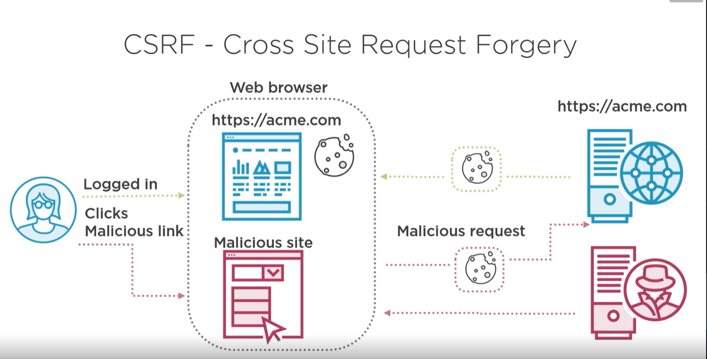
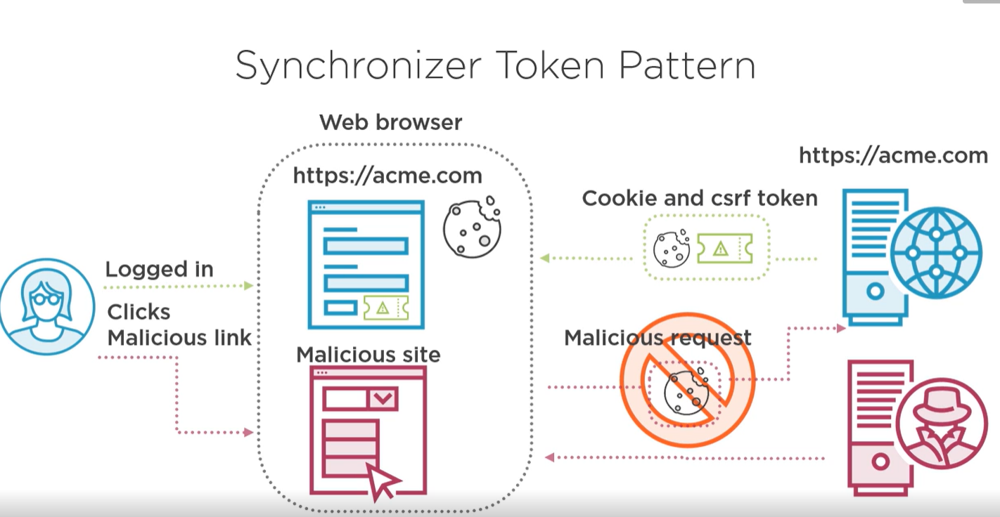

## Penetrating Digest Authentication
We cannot store the password as a one way hash <br>
HA1 = MD5(username: releam: password) <br>
HA2 = MD5(method: digestURI)
response = MD5(HA1: nonce: nonceCount: counce: qop: HA2)
</br><br>
By Default spring security provide :
- CSRF
- 
## CSRF (Cross site resource frogery)
It is an attck that forces an end user to execute unwanted action on a web application in which they are currently authenticated.
- When user are on website the server send the cookie which is in future used server to check whether request comming from authentic user and save from re-authentication.
- if user click on any malicious website from their website
- and when malicious website send any request to server 
- Browser will automatically add cookie of that website
- and server will send the response as cookie is already valid cookie. 

<br><br>
To omit we use csrf token along with cookie as browser don't know token and it will not automatically add token with the request.
</br></br>
if using spring mvc and thymeleaf it will add input type="hidden" with csrf token in form and will send the data. if csrf token is not found then it will give 403. It will applicable only on state change operation like(POST, PUT, PATCH, DELETE).

```java
http.csrf();
```
```html
<input type="hidden" name="_csrf" value="f5bfc744-1cdb-4f7c-9048-f329a93840aa">
```

In case  of SPA we have to manually send it. So in backend we can add csrf token in cookie. and then take from it.
```java
http.csrf().csrfTokenRepository(CookieCsrfTokenRepository.withHttpOnlyFalse())
```x`